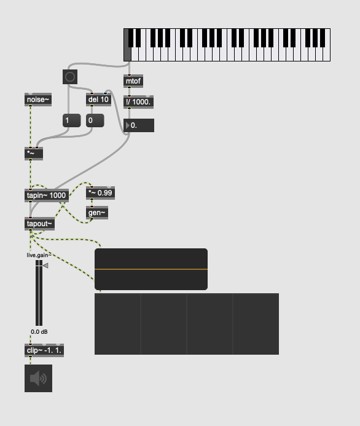

# max-aa-exporter

This exports max pacher as ascii art.

## prerequisite
Install [graph-easy](https://github.com/ironcamel/Graph-Easy).
```
$ cpan Graph::Easy  # mac
```

## usage
```
$ poetry run python -m max_aa_exporter -f ./testdata/karplus_strong.maxpat | graph-easy
+-------+     +-----+     +-----------------+
| msg:1 | <-- | btn | <-- |     kslider     |
+-------+     +-----+     +-----------------+
  |             |           |
  |             |           |
  |             |           v
  |             |         +-----------------+
  |             |         |    obj:mtof     |
  |             |         +-----------------+
  |             |           |
  |             |           |
  |             |           v
  |             |         +-----------------+
  |             |         |  obj:!/ 1000.   |
  |             |         +-----------------+
  |             |           |
  |             |           |
  |             |           v
  |             |         +-----------------+
  |             |         |     flonum      | --------------------------+
  |             |         +-----------------+                           |
  |             |           |                                           |
  |             |           |                                           |
  |             |           v                                           |
  |             |         +-----------------+                           |
  |             +-------> |   obj:del 10    |                           |
  |                       +-----------------+                           |
  |                         |                                           |
  |                         |                                           |
  |                         v                                           |
  |                       +-----------------+                           |
  |                       |      msg:0      |                           |
  |                       +-----------------+                           |
  |                         |                                           |
  |                         |                                           |
  |                         v                                           |
  |                       +-----------------+     +------------------+  |
  +---------------------> |     obj:*~      | <-- |    obj:noise~    |  |
                          +-----------------+     +------------------+  |
                            |                                           |
                            |                  +------------------------+
                            v                  |
                          +-----------------+  |  +------------------+
                       +> | obj:tapin~ 1000 |  |  |  spectroscope~   |
                       |  +-----------------+  |  +------------------+
                       |    |                  |    ^
                       |    |                  |    |
                       |    v                  v    |
                       |  +------------------------------------------+     +-------------+
                       |  |               obj:tapout~                | --> | live.scope~ |
                       |  +------------------------------------------+     +-------------+
                       |    |                       |
                       |    |                       |
                       |    v                       v
                       |  +-----------------+     +------------------+
                       |  |   obj:*~ 0.99   |     |    live.gain~    |
                       |  +-----------------+     +------------------+
                       |    |                       |
                       |    |                       |
                       |    v                       v
                       |  +-----------------+     +------------------+
                       +- |    obj:gen~     |     | obj:clip~ -1. 1. |
                          +-----------------+     +------------------+
                                                    |
                                                    |
                                                    v
                                                  +------------------+
                                                  |      ezdac~      |
                                                  +------------------+
```


